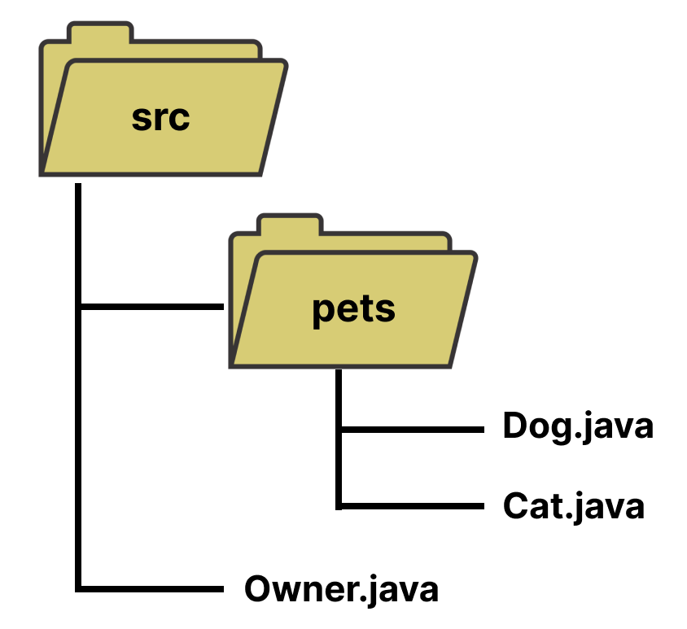
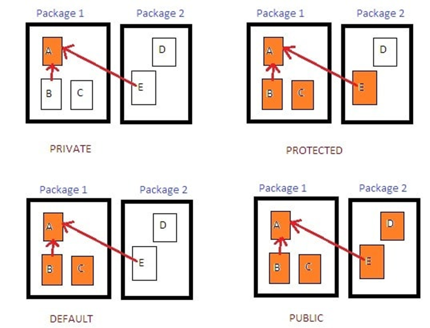
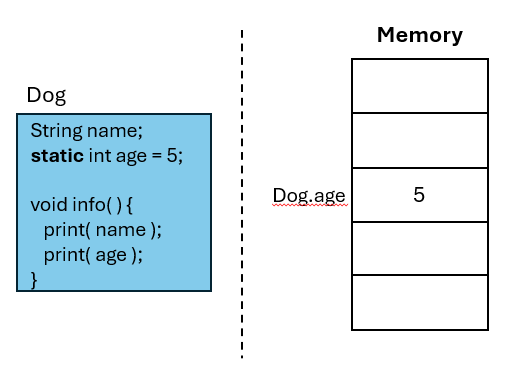
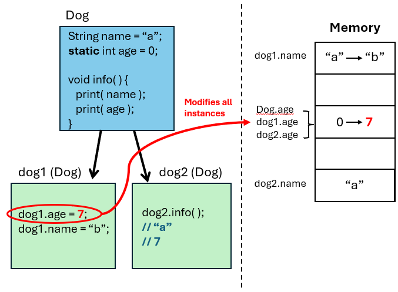

# Homework 2

In this homework you will practice working with **packages**, **classes & objects**, **access modifers**, and **static**.

## Before you start

### Packages

In Java you can group files or classes into sub-directories (folders) known as packages. Packaging your classes allows you to organize your classes, especially if you have classes with the same name. 

**Example:**



See below how the `Owner` class can import the `Dog` class in the `pets` package.

```java
// Name of the parent folder.
package pets;

public class Dog {
    // Members go here.
}
```

```java
// Import the class using [package_name].[class_name]
import pets.Dog;
import pets.Cat;

public class Owner {
    public static void main(String[] args) {
        // You can now use class.
        Dog dog1 = new Dog();
        Cat cat1 = new Cat();
    }
}
```

For more practice with packages in Java visit https://www.w3schools.com/java/java_packages.asp and https://www.programiz.com/java-programming/packages-import.

### Access Modifiers

In Java, by default all classes and their members are **package-private**. This means the class and its members are only accessible within their current directory. When working with packages, it's important to know which access modifier to use.



**Java Access Modifiers**
- Package-Private (*Default*)
- Public
- Private
- Protected

**Example:**

```java
package pets;

public class Cat {
    public String name; // All classes anywhere can access name.
    private String secret; // Only the Cat class can access secret.
    protected int age; // Only other classes in the pets package and extending classes can access age.
    double weight; // Only other classes in the pets package can access.
}
```

For more practice with access modifiers in Java visit https://www.w3schools.com/java/java_modifiers.asp .

### Static 

The static keyword is used for accessing methods and attributes from a class without an object. The static keyword must be added before the type of the attribute or method.

**Static variables** are initiated prior to being instanciated. This means static variables are allocated in memory prior to the creation of any objects.



Thus the same static variable is used throughout all instances (objects). If a static variable is updated either through the class or an object, it gets updated for everyone since they are all referencing the same memory location.



<br>

### Let's begin!

## Problem 1

### Car Dealership

Assume you are hired as a programmer at a Car Dealership. You open up their source code and to your shock you realize the previous developrs didn't know OOP.

This is the code you see... Shocking isn't it.

```java
// Car 1
String car1_make = "Totyota";
String car1_model = "Camry";
int car1_year = 2000;

// Car 2
String car2_make = "Ford";
String car2_model = "Mustang";
int car2_year = 2005;

// Car 3
String car3_make = "Nissan";
String car3_model = "Altima";
int car3_year = 2012;

// Buyer 1
String buyer1_name = "Bob Bobbert";
int buyer1_phone = 1234567;
float buyer1_creditScore = 800.0f;

// Buyer 2
String buyer2_name = "Carl Carlton";
int buyer2_phone = 9876543;
float buyer2_creditScore = 670.5f;
```

The code above has already been added into your Problem1 class. Your assignment is to refactor the code above to use **classes** & **objects**.

Create your classes in their designated file in the `problem1` directory and be sure to include the following:

- Your **class is public**.
- Your **class has a constructor**.
- Your **class attributes & methods are public**.

**Note**: For your constructors, setup your parameters in the following order:
- Car( *make*, *model*, *year* )
- Buyer( *name*, *phone*, *creditScore* )

<br>

## Problem 2

### Student Manager

Assume you are hired by the UTRGV Student Management Office and you are tasked with refactoring the code from the previous developer.

```java
// The school_id will be the same for all students.
String school_id = "utrgv@ut_systems";

// Student 1
String student1_name = "Bob Bobbert";
String student1_email = "bob@utrgv.edu";
String student1_school_id = school_id;
System.out.printf("Name: %s, Email: %s, School ID: %s \n", student1_name, student1_email, student1_school_id);

// Student 2
String student2_name = "Carl Carlton";
String student2_email = "carl@utrgv.edu";
String student2_school_id = school_id;
System.out.printf("Name: %s, Email: %s, School ID: %s \n", student2_name, student2_email, student2_school_id);

// Student 3
String student3_name = "Jane Janeson";
String student3_email = "jane@utrgv.edu";
String student3_school_id = school_id;
System.out.printf("Name: %s, Email: %s, School ID: %s \n", student3_name, student3_email, student3_school_id);
```

Refactor the code above to use OOP. Create a class `Student` inside the `problem2` directory with the following **public** attributes `name`, `email`, and `school_id` and create a **public** constructor to assign values to <ins>`name` and `email` ONLY</ins>.

Since all students have the same `school_id`, make `school_id` a **static** variable.

Next, create an `info()` function inside `Student` to print out an individual student's information.

<br>

## Problem 3

### Custom Vector Class

Let's revisit and old CS2 topic, Vectors!

The following `IntVector` class is a custom C++ vector class for integers only.

```cpp
class IntVector {

    int max = 3;
    int * data;
    int current = 0;
    void resize(); // resizes array when full
    
    public:    
    IntVector(); // will create our dynamic array.
    void push_back(int item); // add items to the Vector 
    int at(int index); // returns a value
    void pop_back(); // removes last item
    int size(); // returns current size 
};

void IntVector::resize() {
    // create a new array
    max = max * 2;
    int* temp = new int[max]; // twice the size of data 
    
    // copy contents of data into temp 
    for(int index = 0; index < (max / 2); index++) {
        temp[index] = data[index];
    }
    
    // make data point to temp (new bigger array)
    int* temp2 = data;
    data = temp;
    // delete the originla array
    delete[] temp2;
}

IntVector::IntVector() {
    data = new int[ max ];
}

void IntVector::push_back(int item) {
    if (current >= max) {
        resize();
    }
    data[current] = item;
    current++;
}

int IntVector::size() {
    return current;
}

int IntVector::at(int index) {
    if (index > current) {
        throw invalid_argument("index is out of bounds");
    }
    return data[index];
}

void IntVector::pop_back() {
    if (current > 0) {
        current--;
    }
}
```

Recreate the `IntVector` class in Java.

Make sure to have the following **methods**:

- **Constructor** (*public*)
- **push_back()** (*public*)
- **size()** (*public*)
- **at()** (*public*)
- **pop_back()** (*public*)
- **resize()** (*private*)

And, the following **attributes** (class variables):

- **data[]** (*private*)
- **max** (*private*)
- **current** (*private*)


## Grading Criteria
| Criteria | Points |
|---|---|
| Problem 1 Car class missing or not packaged | -10 |
| Problem 1 Buyer class missing or not packaged | -10 |
| Problem 2 Student class missing or not packaged | -10 |
| Problem 2 student_id is not static | -20 |
| Problem 3 IntVector class is missing or not packaged | -20 |
| Problem 3 IntVector class methods don't work or have incorrect access modifiers | -30 |

[How to Submit Assignments to GitHub](https://joselitoguardado.dev/3326/How_to_Submit_Assignments_to_GitHub.pdf)
