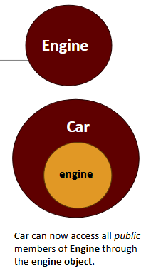
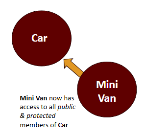
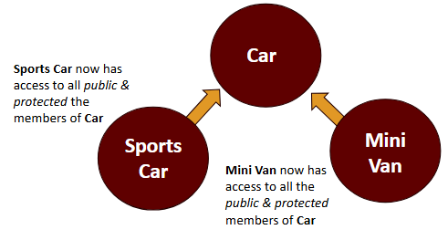
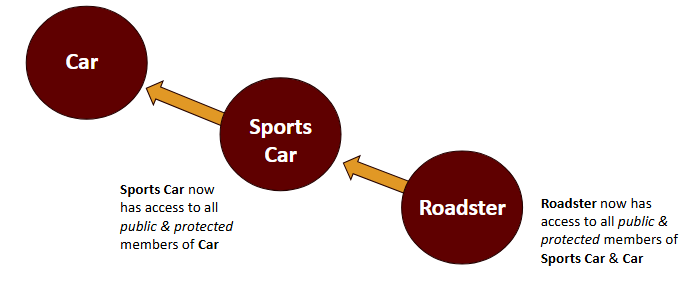

# Homework 3

In this homework you will practice working with **composition**, **simple inheritance**, **multiple inheritance**, **chain inheritance**, and **super**.

## Before you start

### Composition

Composition allows one class to access the members of another class by simply having an object of the inner-class as an attribute in the outer-class. Composition can have multiple instances of the inner-class within and this can offer us better control over another class in comparison to inheritance. 



Composition only gives the **outer-class** (Car) access to the *public members only* of the **inner-class** (Engine).

**Example:**

```java
public class Engine {
    public String fuel;
    public int cylinders;
}
```

```java
public class Car {
    public String make;
    public Engine engine = new Engine();

    public void about() {
        System.out.println("Make: " + this.make);
        // Has access to Engine public members through engine.
        System.out.println("Fuel: " + engine.fuel);
        System.out.println("Cylinders: " + engine.cylinders);
    }
}
```

To learn more about composition in Java visit: https://dev.to/mohamad_mhana/composition-in-java-building-objects-the-smart-way-3ahm

### Simple Inheritance

Inheritance can be defined as the process where one class can access the members (methods and fields) of another. With the use of inheritance, the information is made manageable in a hierarchical order.

The class which inherits the properties of other is known as **subclass** (child class) and the class whose properties are inherited is known as **superclass** (parent class). The subclass can *only access public and protected member*.



**Example:**

```java
public class Car {
    public String make;
    public String model;
}
```

```java
public class MiniVan extends Car {
    public float seats;
    
    public void about() {
        System.out.println("Seats: " + this.seats);
        // Has access to public & protected members from Car
        System.out.println("Make: " + super.make);
        System.out.println("Model: " + super.model);
    }
}
```


In simple inheritance, multiple classes can extend to a single class.



**Example:**

```java
public class SportsCar extends Car {
    public float max_speed;

    public void about() {
        System.out.println("Max Speed: " + this.max_speed);
        // Also has access to public & protected members from Car
        System.out.println("Make: " + super.make);
        System.out.println("Model: " + super.model);
    }
}
```

To learn moare about simple inheritance in Java visit: https://www.w3schools.com/java/java_inheritance.asp

### Chain Inheritance 

Chain inheritance follows the same properties as simple inheritance, where one class (subclass) extends to another (superclass), however now we may have that superclass extend to another class to form a chain structure. 



In this example the child-most class Roadster will inherit both the public & members of SportsCar and Car.

**Example:**

```java
public class Car {
    public String make;
    public String model;
}
```

```java
public class SportsCar extends Car {
    public float max_speed;

    public void about() {
        System.out.println("Max Speed: " + this.max_speed);
        // Has access to public & protected members from Car
        System.out.println("Make: " + super.make);
        System.out.println("Model: " + super.model);
    }
}
```

```java
public class Roadster extends SportsCar {
    public boolean all_terrain;

    public void about() {
        System.out.println("All Terrain: " + this.all_terrain);
        // Has access to public & protected members from Car & SportsCar
        System.out.println("Make: " + super.make);
        System.out.println("Model: " + super.model);
        System.out.println("Max Speed: " + super.max_speed);
    }
}
```

### Super Constructor

The super keyword can be used to reference or access class variables and members of the super or parent class, however it can also be used to call the constructor of a parent class.

The parent constructor `super()` must be called within the subclass constructor and at the very beginning.

**Example:**

```java
public class Car {
    public String make;
    public String model;

    public Car(String make, String model) {
        this.make = make;
        this.model = model;
    }
}
```

```java
public class Truck extends Car {
    public float bed_size;

    public Truck() {
        // super() calls the parent constructor
        super("n/a", "n/a");
        this.bed_size = 0;
    }
}
```

Learn more about super in Java visit: https://www.w3schools.com/java/java_super.asp and https://www.geeksforgeeks.org/java/super-keyword/

<br>


### Let's begin!

## Problem 1

### LinkedList - Composition

For this homework problem you will need to create a LinkedList in Java. Use composition to create a Node object within your LinkedList class. Remember to encapsulate your head node to prevent unwanted tampering with your list.

Create your Node class in the `problem1/Node.java` file and your LinkedIn class in the `problem1/LinkedList.java` file.

Create the following **private** attribute in LinkedList:
- `head`

Create the following **public** methods in LinkedList:
- `insert()`
- `size()`
- `get()`

You can test your solution by running `Test_Problem1.java`.

<br>

## Problem 2

### Housing Orgainzer - Simple Inheritance

Assume you are hired to work for a housing organization and you notice their developer has created a class for each house type: `Condo`, `Duplex`, and `Townhouse`. You then notice most of the attributes and methods within each class are the same.... interesting.

Refactor the house classes in the `problem2/` package by creating a parent class `House` and removing any repetitive and redundant code.

You can test your solution by running `Test_Problem2.java`.

<br>

## Problem 3

### Employee Management - Chain Inheritance

Assume you are now hired by a Credit Union that requires all of its employees to become members of credit union prior to employment (Obviously you had to enroll as well). Now they put you in charge of their employee management software and you notice they also have a class for each employee type: `Member`, `Employee`, `Manager`, `RegionalManger`. You also notice most attributes and methods also repeat.... interesting.

Refactor the empoyee classes in the `problem3/` package by using chain inheritance to remove any repetitive and redundant code.

You can test your solution by running `Test_Problem3.java`.

<br>

## Grading Criteria
| Criteria | Points |
|---|---|
| Problem 1 Node class is not inside Node.java | -10 |
| Problem 1 LinkedList class does not pass the tests | -20 |
| Problem 2 House class is not inside House.java | -10 |
| Problem 2 Condo, Duplex, and Townhouse do not pass tests | -20 |
| Problem 2 There is duplicate attributes | -10 |
| Problem 3 Employee, Manager, RegionalManager don't pass tests | -20 |
| Problem 3 There is duplicate attributes | -10 |

[How to Submit Assignments to GitHub](https://joselitoguardado.dev/3326/How_to_Submit_Assignments_to_GitHub.pdf)
